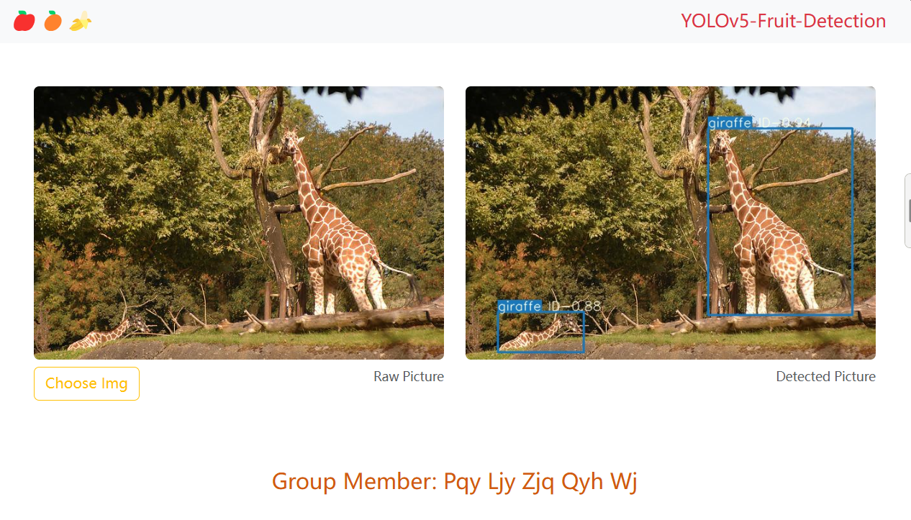
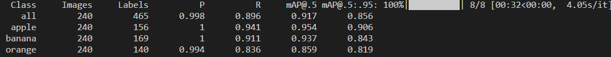

# Detection-yolov5

## 中山大学人工智能学院 2022 级小组大作业

### 数据收集与标注

使用 [labellmg](https://github.com/HumanSignal/labelImg/blob/master/readme/README.zh.rst) 标注图片并将 5 张只包含苹果的，5 张只包含香蕉的，5 张只包含橙
子的，5 张包含两种或两种以上(mixed)的水果的图片和标记生成的 xml 文件置于 label_data 文件夹下

### 水果检测模型

实现 yolov5 模型版本为 v7，训练水果检测模型，predict.py 文件在 datasets 文件夹中对 test 的 img 进行测试

### 前端界面



代码实现在 frontend 文件夹中，采用 vue，和 [bootstrap](https://getbootstrap.com/) 框架
共用三个 component

- Header
- Content
- Footer

#### Project setup

```
npm install
```

#### Compiles and hot-reloads for development

```
npm run serve
```

### 后端

采用 flask 框架，和 yolov5 模型。用户上传图片后放置在 uploads 文件夹中，然后使用 detect.py 预测文件并将结果输出到 tmp 文件夹并显示到前端页面

模型结果:


#### Project setup

```
python app.py
```
